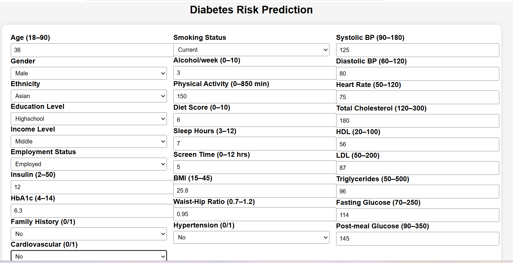
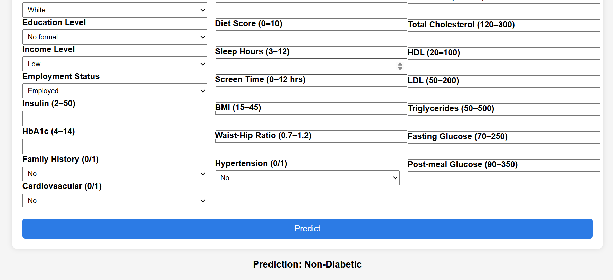

# 🩺 Diabetes Risk Prediction – End-to-End Machine Learning Web Application

## 📌 Project Overview

This project is an end-to-end machine learning solution designed to predict the risk of diabetes based on lifestyle, demographic, and clinical health indicators.  

The goal is to help identify individuals who may be at higher risk of diabetes so that early interventions and preventive care can be encouraged.

The complete system follows **industry best practices**, including:
- Modular coding architecture
- Feature engineering 
- Data transformation
- Machine learning pipelines   
- Model training and evaluation  
- Web application development using Flask  
- Cloud deployment with Render 

---

## 🌐 Live Application

You can access the deployed web application here:

🔗 **Live Demo:**  
https://diabetes-prediction-app-8y4j.onrender.com

## 📸 Web Application Screenshots

---

## 🎯 Key Objectives

- Build a **reliable diabetes prediction model**
- Follow **clean software engineering principles**
- Ensure **training-serving consistency**
- Provide a **user-friendly web interface**
- Deploy the application to the cloud

---

## 🔹 Modular Coding Approach

Instead of writing everything in one file, the project is divided into **logical modules**, each responsible for a specific task:

| Module | Purpose |
|--------|----------|
| Data Ingestion | Reads and loads dataset |
| Feature Engineering | Creates new meaningful features |
| Data Transformation | Scaling & encoding |
| Model Trainer | Builds and trains ML model |
| Train Pipeline | Orchestrates training |
| Predict Pipeline | Handles inference |
| Flask App | User interface |

This structure makes the system:
- Easy to maintain  
- Easy to debug  
- Production-ready  

---

## 🔹 Data Ingestion

**Purpose:**  
Load the dataset from a file source into a Pandas DataFrame.

**What happens:**
- Reads CSV file
- Performs basic validation
- Returns dataset for further processing

---

## 🔹 Feature Engineering

We create new features based on medical knowledge to improve model performance.

### Examples

**1. homa_ir**

**2. obesity_risk_indexr**

**3. lifestyle_risk_score**

---

## 🔹 Data Preprocessing

Different numerical features behave differently, so we use different scalers:

| Technique | Used for |
|-----------|----------|
| StandardScaler | Normally distributed data |
| RobustScaler | Data with outliers |
| Ordinal Encoding | Ordered categories |
| Pass-through | Nominal categories |

This ensures:
- No data leakage  
- Model stability  
- Real-world reliability  

---

## 🔹 Machine Learning Pipeline

We use **Scikit-learn Pipelines** to combine all steps:
> Feature Engineering → Preprocessing → Model

This guarantees:
- Same transformations during training & prediction  
- No manual preprocessing  
- Clean production workflow  

---

## 🔹 Model Training

We experimented with multiple models:

- Logistic Regression  
- Decision Tree  
- Random Forest  
- XGBoost  
- LightGBM  
- CatBoost

After evaluation, **RandomForest** was selected due to:

- High ROC-AUC  
- Stable performance  
- Excellent handling of categorical features

### Hyperparameter Tuning

We applied **RandomizedSearchCV** to find optimal model parameters automatically.

---

## 🔹 Training Pipeline

The training process is fully automated:

1. Load data  
2. Split into train/test  
3. Build pipeline  
4. Train model  
5. Save trained model  

The trained model is stored as:
> artifacts/model.pkl

---

## 🔹 Prediction Pipeline

During prediction:

- Load saved pipeline  
- Apply same transformations  
- Generate prediction  

This ensures **training-serving parity** (no mismatch).

---

## 🌐 Web Application (Flask)

We built a clean and user-friendly web interface using Flask.

### Features

- 3-column layout  
- Input validation  
- Dropdowns for categorical data  
- Real-time prediction  
- Displays engineered features  

Users simply fill in the form and click **Predict** to see results.

---

## 🔐 Best Practices Followed

✔ Modular architecture
✔ Clean pipelines
✔ Feature engineering inside pipeline
✔ No data leakage
✔ Logging & exception handling
✔ Cloud deployment

---

## 🧪 How to Run Locally

> Clone github repo using git clone [repo link]\
> Create enviornment: `conda create -p venv python==3.13 -y`\
> Activate enviornment: `conda activate venv\`\
> Install requirements: `pip install -r requirements.txt`\
> Run `python app.py`

Open in browser:
http://127.0.0.0:5000

---

## 📌 Conclusion

This project demonstrates how to build a real-world machine learning system following industry standards:
- Proper code structure
- Robust ML pipeline
- Explainable features
- Web deployment

It can easily be extended to:
- Add new models
- Improve UI
- Integrate real hospital data
- Provide detailed health reports

---

## 👨‍💻 Author

**Muhammad Basharat Asghar**
[Portfolio](https://basharat-asghar.github.io/BasharatPortfolio/) [LinkedIn](https://www.linkedin.com/in/basharat-asghar/) [Kaggle](https://www.kaggle.com/mbasharatasghar)
Data Science & Machine Learning Enthusiast

---
## ⭐ Support

If you find this project helpful, please consider giving the repository a ⭐
Your support is highly appreciated!
